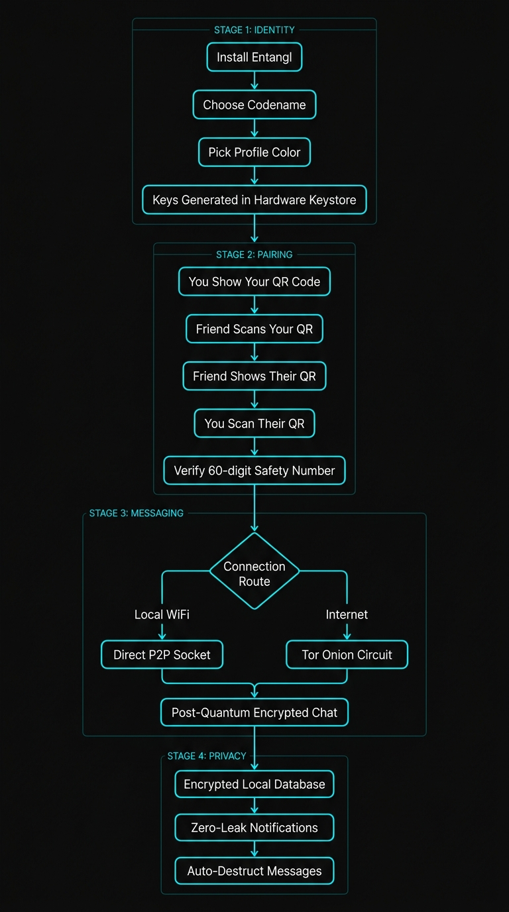
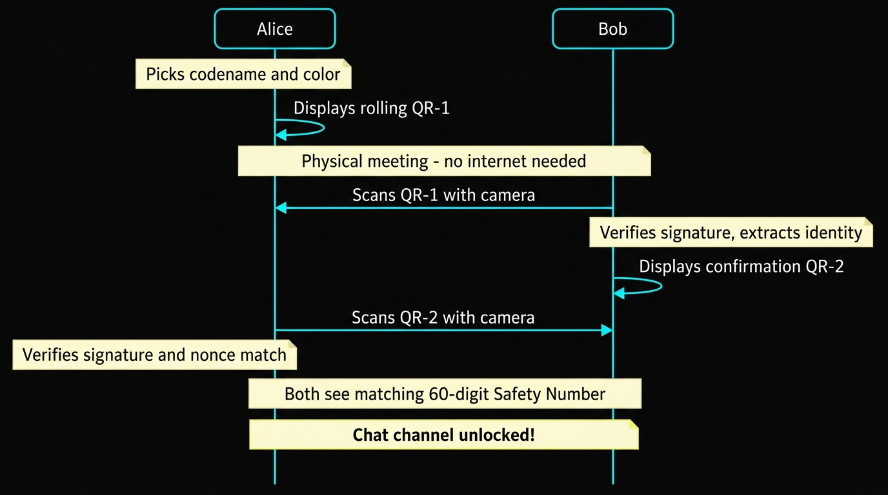
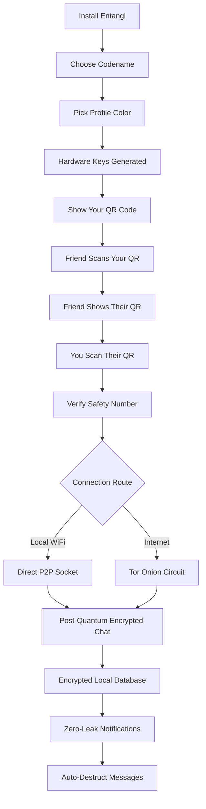
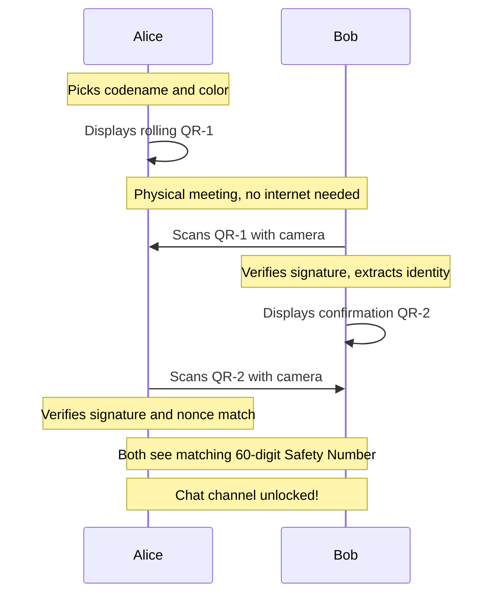

<p align="center">
  
</p>

<h1 align="center">Entangl</h1>

<p align="center">
  <strong>Zero-Knowledge, Post-Quantum Secure Peer-to-Peer Android Messenger</strong>
</p>

<p align="center">
  
  
  
  
</p>

---

**Entangl** is a privacy-first, decentralized-identity Android messaging application. Unlike traditional chat apps that rely on phone numbers, usernames, or public directories, Entangl establishes communication channels exclusively through a **Mutual Physical Handshake** using two-way dynamic QR code verification.

Neither user can send a message until both parties have physically scanned each other's visual public identity keys and nonces.

## Core Features

* **Zero Trust Discovery:** Eradicate spam, unsolicited requests, and bulk scraping by enforcing in-person or out-of-band mutual scanning.
* **True Peer-to-Peer (P2P) Architecture:** Communicate directly device-to-device via local Wi-Fi discovery and Tor Onion Services (`arti`). Messages are never stored on any backend or third-party infrastructure.
* **Post-Quantum End-to-End Encryption:** Utilizes a hybrid **PQXDH (X25519 + ML-KEM-768 Kyber)** ratchet via `libsignal-client` to defend against Store Now, Decrypt Later (SNDL) attacks.
* **Two-Layer Encryption Model:** Messages are encrypted via the Double Ratchet Protocol (Forward Secrecy, Post-Compromise Security), and the encrypted payloads are then transported over Tor (anonymity and transport encryption).
* **Cryptographic Identity & Visual Customization:** Choose your secret codename and custom `#RRGGBB` profile color with live HSV color picker, cryptographically bound and signed via Ed25519 keys.
* **Strict On-Device Security:** Keys are kept in native memory buffers (`NativeKeyBuffer`) and zeroed out explicitly. State integrity is backed by Android Keystore. Includes defenses against tapjacking, ADB backups, screenshots (`FLAG_SECURE`), and memory scraping.

---

## How It Works for Users

Entangl eliminates central servers, phone numbers, and cloud databases. Here is how it works from the user's perspective:

### 1. User Journey Overview



> **Stage 1 — Identity:** No phone number or email. You pick a codename and color, and cryptographic keys are generated inside your phone's hardware security chip.
>
> **Stage 2 — Pairing:** You and your contact physically scan each other's QR codes. Both phones verify a matching 60-digit Safety Number before unlocking the chat.
>
> **Stage 3 — Messaging:** Messages route over local Wi-Fi (zero latency) or Tor hidden services (full IP anonymity), encrypted with a hybrid post-quantum ratchet (ML-KEM-768 Kyber + X25519).
>
> **Stage 4 — Privacy:** Everything stored in SQLCipher encrypted database. Lockscreen notifications are hidden (`VISIBILITY_SECRET`). Keys are zeroed from memory after use.

### 2. The In-Person Pairing Experience

Connecting with a contact takes under 15 seconds and requires zero network access:



<details>
<summary>View Mermaid source (for GitHub rendering)</summary>





</details>

### 3. Why This Protects You

| What Traditional Apps Do | How Entangl Protects You |
| :--- | :--- |
| **Phone number / email required** | **Zero accounts.** Your identity is a local cryptographic key pair generated inside your phone's hardware security module (StrongBox). |
| **Centralized servers hold messages** | **Zero servers.** All messages travel directly peer-to-peer via local Wi-Fi sockets or encrypted Tor Onion hidden services. |
| **Contact list scraped into the cloud** | **Zero directory.** Contacts are only established when two physical devices scan each other. Nobody can discover your contacts. |
| **Lockscreen notifications show text & senders** | **Zero-leak notifications.** Notifications use `VISIBILITY_SECRET`. The lockscreen stays blank, and alerts are generic without previews. |
| **Vulnerable to future quantum computers** | **Post-quantum secure.** Over-the-air ratchet exchanges use **PQXDH (ML-KEM-768 Kyber + X25519)**, neutralizing Store Now, Decrypt Later attacks. |
| **Screen capture & memory snooping** | **Hardened on-device.** Protected with `FLAG_SECURE`, anti-tapjacking view filters, and instant native memory zeroization (`NativeKeyBuffer`). |

---

## Getting Started

### Prerequisites
* Android Studio Ladybug (or newer)
* Java 17
* Android SDK API 35

### Building the Project
1. Clone the repository:
   ```bash
   git clone https://github.com/your-org/entangl-android.git
   ```
2. Open the project in Android Studio.
3. Sync Gradle.
4. Build and run on an emulator or physical device.

## Architecture Highlights
* **UI:** 100% Jetpack Compose (Material 3). Designed with adaptive layouts for foldables.
* **Cryptography:** `libsignal-client` (Rust via JNI) and `sodium_memzero` for key lifecycle management.
* **Local Storage:** `SQLCipher` for encrypted Room database.
* **Networking:** `arti` (Tor implementation in Rust) for .onion endpoint generation and P2P routing.

## Contributing
We welcome contributions from the community! Please read our [Contributing Guidelines](CONTRIBUTING.md) and [Code of Conduct](CODE_OF_CONDUCT.md).

## Security
If you discover a security vulnerability within Entangl, please refer to our [Security Policy](SECURITY.md) for reporting instructions.

## License
This project is licensed under the **GNU Affero General Public License v3.0 (AGPLv3)** - see the [LICENSE](LICENSE) file for details.
